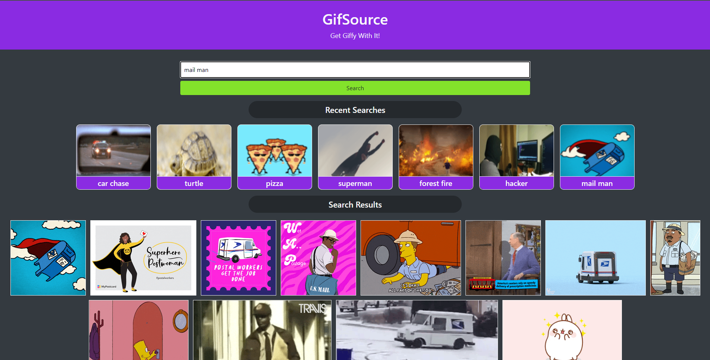

# GifSource
* Get GIFFY with it

# Client Needs:
As a Gif user I want to find the perfect Gif to send to my friends and family. I want to utilize a reliable and searchable database that is requisite to my needs.  This database needs to be easy to use as well as aesthetically pleasing to view.  This database should display the users past searches in an easy and clickable way. The results of each search should present the user with multiple Gif's to choose from as well as provide them the url to access them.

# Deployment
[GitHub](https://github.com/jareddaniel95/GifSource)

[Deployed URL](https://jareddaniel95.github.io/GifSource/)

